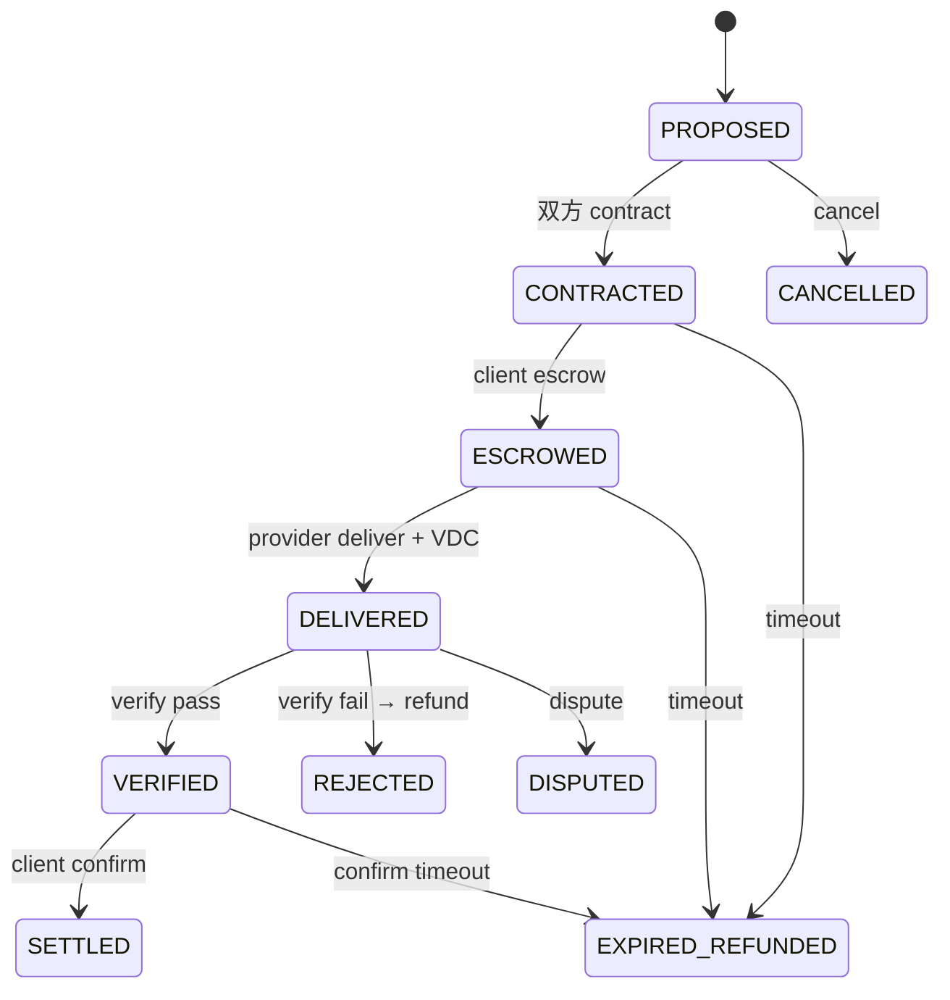
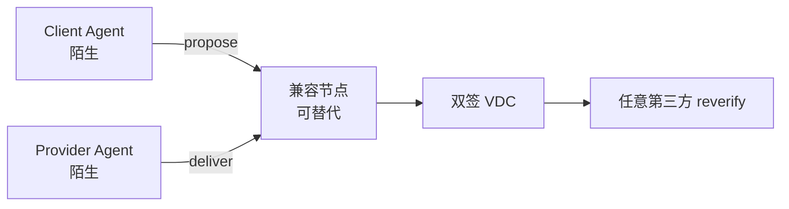

# 场景目录 Catalog

机器可读副本：[`catalog.json`](catalog.json)。

图例：`demoable` = 现可跑通 · `reserved` = 本体/冒烟已有、合规生产未宣称 · `vision` = 叙事灯塔。

---

## L0 · 共用语法

| ID | 标题 | status | 图 |
|----|------|--------|-----|
| S-lifecycle | 标准交割生命周期 | demoable | figures/01-lifecycle.svg |
| S-strangers | 无预建关系的双方 | demoable | figures/02-strangers.svg |
| S-stack | 凭证在上 · 清算在下 | demoable | figures/03-layers.svg |
| S-access-surfaces | 多接入面同一语义 | demoable | （矩阵副栏 / README） |
| S-vs-payment | 交割 vs 支付 | demoable | （对比短图，可选） |

---

## L1 · 现在（软件 Agent）

| ID | 标题 | resource_type | rule / 入口 | status |
|----|------|---------------|-------------|--------|
| S-invoice-extract | 陌生 Agent · 结构化抽取 | data.extraction.structured | R-extract-invoice-v1 · Trial | demoable |
| S-task-generic | 可验收通用任务 | service.task.generic | R-task-status-v1 | demoable |
| S-llm-summary | 模型摘要 / 多裁判 | service.task.generic | LLM judge · consensus | demoable |
| S-token-inference | 推理 Token 用量 | compute.inference.tokens | ontology 已备 | demoable |
| S-reject-refund | 验收拒绝并退款 | （同抽取类） | demo/run_demo reject | demoable |
| S-timeout-expire | 超时清扫退款 | （同抽取类） | sweep / confirm_timeout | demoable |
| S-federation | 跨节点仍可验 | （同抽取类） | plugfest federation | demoable |
| S-witness-stake | 见证与质押（特性开关） | （同抽取类） | NOVAPANDA_WITNESS_V2 | demoable |

### 旗舰嵌套 · 软件排练（L1）

| ID | 标题 | resource_type | rule / 入口 | status |
|----|------|---------------|-------------|--------|
| **S-nested-soft-diligence** | **嵌套 B · 尽调包** | 抽取+任务+LLM | `demo/nested_diligence.py` · NP-BUNDLE | demoable |

海报：[`figures/06-poster-nested.svg`](figures/06-poster-nested.svg) · 组合约定：[`bundle.md`](bundle.md) · 主 UC：**UC-10**

**S-nested-soft-diligence**  
采购 Agent 要「尽调包」= VDC₁ 抽取 + VDC₂ 合规任务 + VDC₃ LLM 摘要（`depends_on` 前两张）。同构明天的物理多腿；**不是**一张超级凭证。

### 场景卡片文案（公开）

**S-invoice-extract**  
双方从未建档。Client 要约「抽取发票字段」，Provider 交付结构化 JSON；Schema 验收通过后双方签 VDC → SETTLED。任何人可 `reverify`。

**S-task-generic**  
通用任务单元：以字段/规则判定「是否完成」，而非人工口头确认。

**S-llm-summary**  
交付物需模型侧评判时，裁判与 audit 快照进入可复验链路（含多裁判共识路径）。

**S-token-inference**  
把「推理用量」当作可交割资源计量，而不是平台黑盒账单。

**S-reject-refund / S-timeout-expire**  
失败路径与成功路径同属协议：拒绝退款、超时退款，避免只讲 happy path。

**S-federation**  
换一台兼容节点，仍能验证同一张 VDC——节点可替代，真理在凭证。

**S-witness-stake**  
可选增强：见证声明与质押，不改变 VDC 第一公民地位。

**S-access-surfaces**  
HTTP / MCP / A2A / Skill 只是翻译层：同一状态机、同一 VDC 语义；见 `spec/BINDING-*.md` 与 `tests/test_surfaces.py`。

**S-vs-payment**  
先留下可复验交付收据（VDC）；mock / x402 / 法币清算在下方可插拔——协议不造币、不替代支付网络。

## L2 · 灯塔（物理与协作）

| ID | 标题 | resource_type / 领域 | status |
|----|------|----------------------|--------|
| S-energy-dc | 直流电能交割（车/桩等） | energy.electric.dc | reserved |
| S-robot-task | 机器人任务完成 | actuation.robot.task | reserved |
| S-robot-fleet | 调度 Agent ↔ 机队分账 | 组合 | vision |
| **S-openclaw-pair** | **车 × OpenClaw 结对** | agent_host 适配器 | **demoable** |
| **S-mqtt-iot-adapter** | **IOT 传感器摘要适配器** | work_fn 适配器 | **demoable** |
| S-av-charge | 自动驾驶车 ↔ 充电设施 | energy + AV 身份 | **demoable** |
| S-av-parking | 车 ↔ 场站泊位 | mobility（候选） | vision |
| S-av-v2x | 车 ↔ 车 / 路侧协同交付 | V2V · V2I | vision |
| S-av-odxd | 车 ↔ 云 Agent 调度结果 | service.task.generic | vision |
| S-uav-mission | 无人机航线任务完成 | aerial（候选） | vision |
| S-uav-airspace | 无人机 ↔ 空域/起降服务 | aerial（候选） | vision |
| S-uav-energy | 无人机 ↔ 充能/换电 | energy.electric.dc | vision |
| S-uav-inspect | 无人机巡检交付 Owner Agent | aerial + data | vision |
| S-iot-sensor-data | 传感 / RSU 可证数据交割 | sensor（候选） | vision |
| S-iot-edge-compute | 边缘算力租用 | compute 族谱 | vision |
| S-cross-domain | 车·无人机·机器人跨域编排 | 组合 | vision |
| S-multi-agent-chain | 多智能体分账协作链 | 组合 | vision |
| S-device-to-device | 设备对设备无账号交换 | 组合（总称） | vision |
| S-human-gate | 人类终审闸（安全/重大责任） | 治理场景 | vision |
| **S-nested-site-patrol** | **嵌套 A · 到场巡检闭环** | 车+无人机+机器人(+充电) | demoable |

### 旗舰嵌套 · 物理灯塔（L2）

海报：[`figures/06-poster-nested.svg`](figures/06-poster-nested.svg) · 主 UC：**UC-11**（含 S-human-gate 扩展）

**S-nested-site-patrol**  
Owner 要「到场巡检闭环」= 车到场 → 无人机巡检 → 机器人接点 → 可选车充；可选人类终审闸。每步一纸 VDC；目标完成 ≠ 一张超级凭证。  
参考竖切：`python demo/adopter_site_patrol.py`（`novapanda.adopter.patrol.SitePatrolBundle`）。

架构判定：单笔 L0–L5 够用；组合靠 **Bundle**（不推倒状态机）。详见 `bundle.md`。

### 生态覆盖（必读）

未来物联网不是「万物接同一个网关」，而是**车、无人机、机器人、软件 Agent 作为对等主体，用同一套交割语法互认交付**。

| 生态位 | 公开表达 | 现状 |
|--------|----------|------|
| 软件 Agent | L1 全套 | ✅ 可演示 |
| 机器人 | S-robot-task 等 | ⚠️ 冒烟有，机队/人机闸待图示 |
| 能源 / 充电 | S-energy-dc · S-av-charge | ⚠️ 表计路径有，车侧身份待强调 |
| 自动驾驶车 | S-av-* | ⚠️ 场景已列（含 odxd），本体/demo 未齐 |
| 无人机 | S-uav-* | ⚠️ 场景已列（含 energy），待图与本体候选 |
| 路侧 / 传感 IoT | S-iot-* · S-av-v2x | ❌ 叙事补齐中 |

**协议管什么 / 不管什么**

- **管**：可验证交付互认（VDC）、陌生主体缔约与验收编排。  
- **不管**：自动驾驶控制栈、飞控、道路/空域运营许可、真实资金清算。  
- **人类终审**：生命、重大安全责任场景必须可见（S-human-gate）。

总图：[`figures/05-iot-ecosystem.svg`](figures/05-iot-ecosystem.svg)。设计检视：仓库内部 `IoT生态覆盖检视`（不阻塞公开目录自洽）。

**S-energy-dc**  
车与桩（或任意供用电对端）无预建商业关系：表计 kWh + metered 证据 → 同一状态机 → VDC。完整持牌清算不在公开 Trial 范围。

**S-robot-task**  
机器人完成可证明任务；dual_signed（及可选 metered）证据进入交割记录。

**S-av-charge / S-av-parking / S-av-v2x / S-av-odxd**  
自动驾驶车作为 Agent：充电、泊位、与路侧/他车的**交付层**协同，以及向云 Agent 交付调度/路线结果——不是替代智驾与车规认证。

**S-uav-mission / S-uav-airspace / S-uav-energy / S-uav-inspect**  
无人机完成航线任务、租用起降/空域时段、在充能/换电点交割能量、向资产 Owner 交付巡检结果。

**S-iot-sensor-data / S-iot-edge-compute**  
传感与边缘算力进入可验交割，而非平台私有遥测黑洞。

**S-cross-domain**  
例如：车调度无人机巡检，机器人完成交接——每步一张可复验收据。

**S-multi-agent-chain**  
多步 Agent 协作：每步可验交付，再谈价格与分账——差异化不在单次 API 扣费。

**S-device-to-device**  
设备以 Agent 身份互认的**总称**；细分见 AV / UAV / IoT 各条。

**S-human-gate**  
机器升到交换密度，人退到宪法高度：安全与重大责任保留人类（或法定）终审。

---

## 场景 ↔ 用例（UC）映射

公开 catalog 是叙事图谱；可测规格以内部 [`用例规格-主清单`](../../internal/design/用例规格-主清单.md) 为准（不阻塞本目录自洽）。

| catalog ID | 主 UC | 认证相关 Profile（L2 自报） |
|------------|-------|------------------------------|
| S-lifecycle · S-strangers · S-invoice-extract… | UC-01…03 | NP-MIN |
| S-access-surfaces | UC-01（接入面） | NP-SUR-01 · C-MCP（意向） |
| S-federation | UC-06 | NP-NODE |
| S-nested-soft-diligence | UC-10 | NP-BUNDLE · C8 |
| S-nested-site-patrol · S-human-gate | UC-11 | NP-BUNDLE · NP-PHYS（成员腿） |
| S-multi-agent-chain | UC-20…21 | NP-CLAIM-XFER（规格；实现 △） |
| S-energy-dc · S-robot-task | — | NP-PHYS · C9 |
| （零号 Operator 注册） | UC-30…31 | BODY（非 CORE MUST） |
| （申请兼容标识） | **UC-40** | C1–C7 + 宣告 Profile Case |

---

## 生命周期（文字图）

---

## 陌生人交割（文字图）

---

## 推演附录 · 百跳价值网

> **状态**：设计推演 · 非规范性 · 不改 CORE 状态机  
> **全文**：内部 [`推演-陌生车百跳价值网`](../../internal/design/推演-陌生车百跳价值网.md)

在智慧园区设定下，**陌生车 V0** 与桩、无人机、机器人（MCP）、云 Agent（Skill）、传感与联邦节点完成 **101 笔 SETTLED** 交换；价值经 **M1–M4** 四范式在主体间转手，**锚定 VDC、不铸协议币**。

| 阶段 | 笔数 | 主 catalog | 范式 |
|------|:----:|------------|------|
| A 嵌套巡检 | 21 | S-nested-site-patrol | M1+M2+M3 |
| B 能源网格 | 40 | S-energy-dc · S-av-charge | M1 |
| C 机器人 MCP | 10 | S-access-surfaces · S-robot-task | M2 |
| D Skill 编排 | 20 | S-nested-soft-diligence | M2+M3 |
| E Claim 转让 | 20 | S-multi-agent-chain · S-federation | M4 |

**诚实标注**：L2 物理真机腿仍为 **vision**；C-MCP / BUNDLE / sandbox 结算已有向量或 demo。
