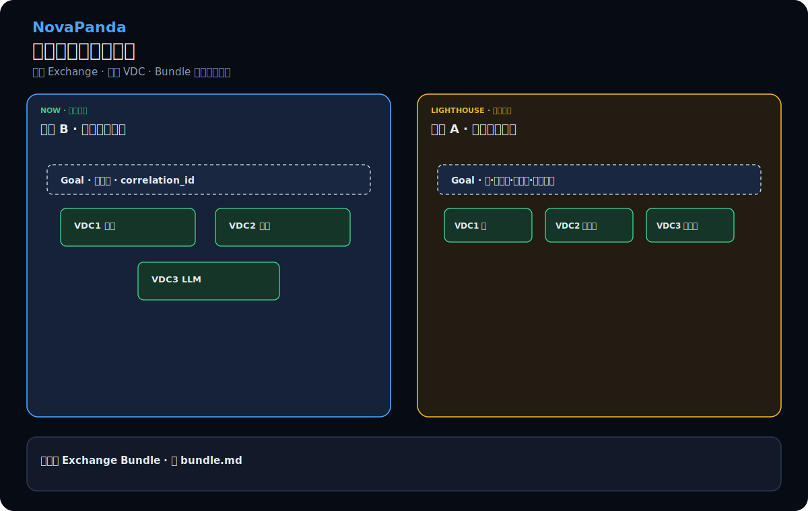
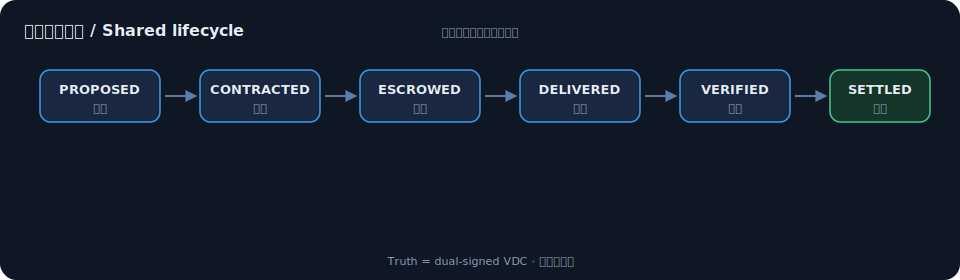
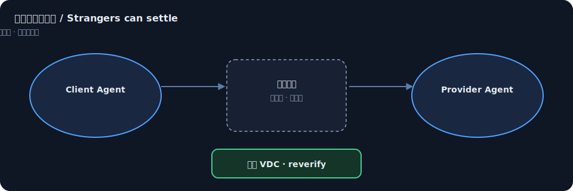
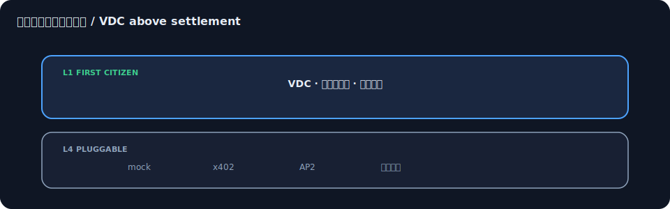
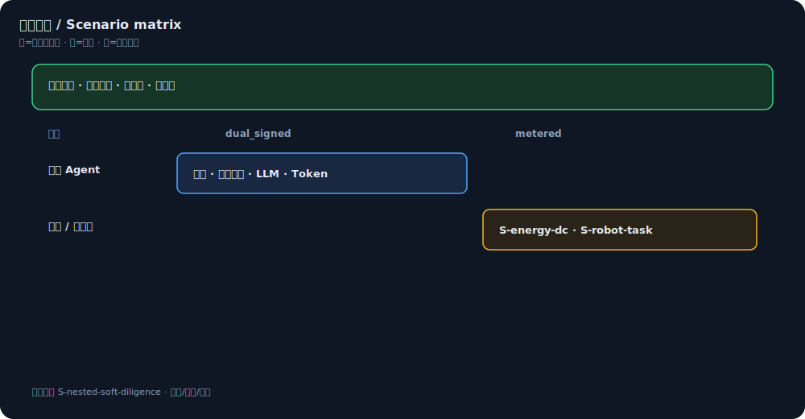
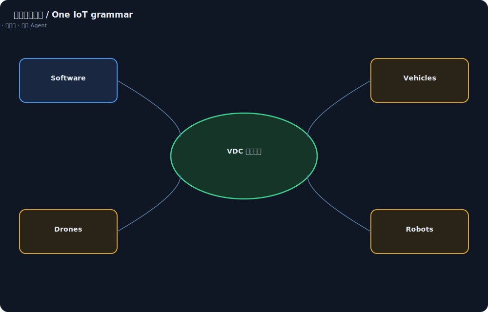

# 场景总览 Overview

访客三分钟读懂 NovaPanda 交换场景。详细目录见 [catalog.md](catalog.md)。

## 0 · 产品海报（嵌套初衷）



**一笔业务，多张收据。** 软件尽调（现可排练）⟷ 到场巡检（灯塔）同构。见 [bundle.md](bundle.md)。

## 1 · 共用语法



所有场景走同一状态机；成功终点是 **SETTLED + 双签 VDC**，失败也有一等公民路径（拒绝 / 超时退款）。

## 2 · 陌生人也能交割



不要求共用账号体系。节点只编排，**不持有 Agent 私钥**；真理在 VDC。

## 3 · 先统一交割，再谈货币



## 4 · 能换什么



## 4b. 物联网经济全景



自动驾驶车、无人机、机器人与软件 Agent 是**对等主体**；基础设施（桩、RSU、起降点、边缘）亦可作为 Agent 接入。协议统一的是**交割互认**，不是控制回路或发币。

| 现在（可演示） | 灯塔（同一语法） |
|----------------|------------------|
| 抽取 · 任务 · LLM · Token | 电能 · 机器人 · **AV / UAV / 传感 IoT** |
| 拒绝 / 超时 / 联邦 | 跨域编排 · 人类终审 |

## 5. 自己跑一遍

```bash
python demo/trial_remote.py
python demo/plugfest.py
```

零号节点将提供 **场景** Tab，数据源即本目录的 [`catalog.json`](catalog.json)。

## 6. 生态八域

广括生态（远程服务、本地执行、编排、规则、工具、升级、安全、网格）如何挂接同一交割语法：

→ [`ecosystem-eight-domains.md`](ecosystem-eight-domains.md) · [网页版](ecosystem-eight-domains.html)
